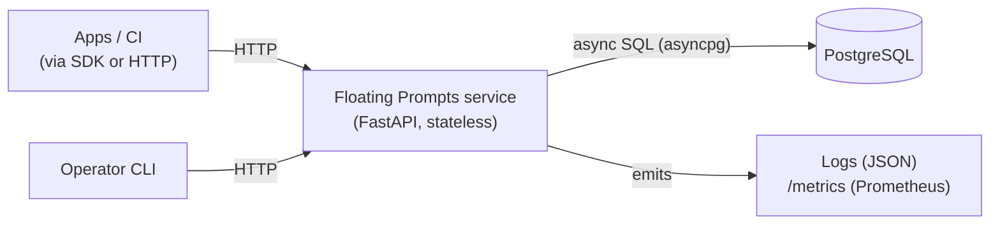
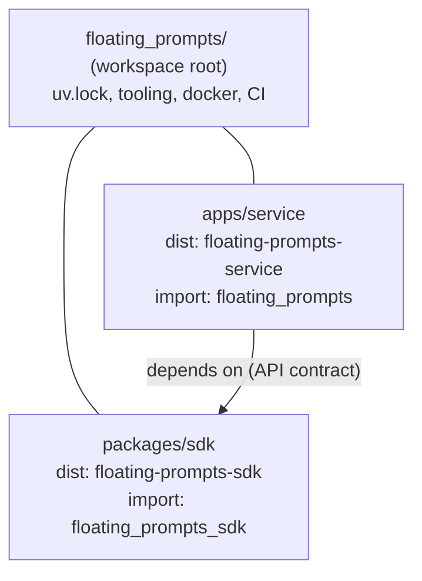
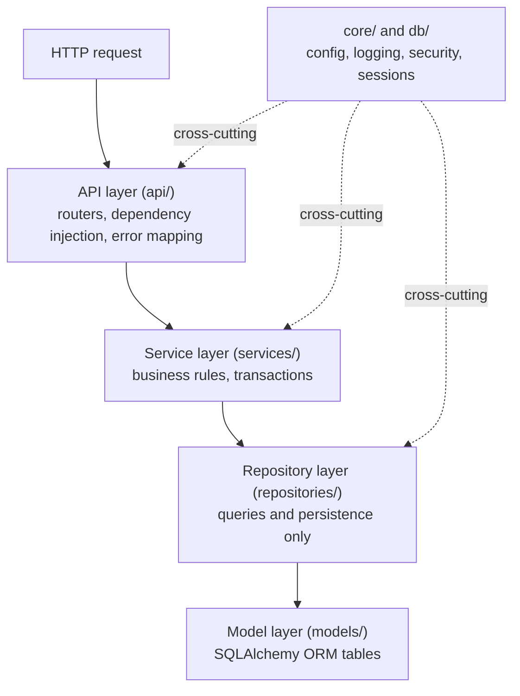
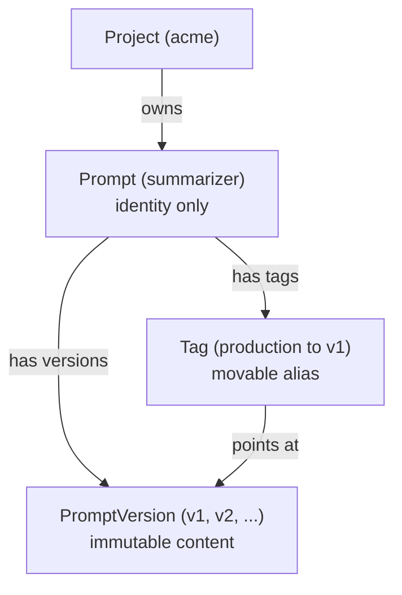
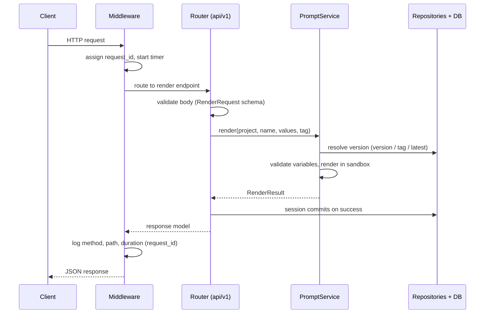

# Floating Prompts, Architecture

**Audience:** engineering leadership and new engineers.
**Goal:** read this once and understand the whole system: what it does, how it is
built, and where to add code.

**Status:** v0.1, async Python service plus SDK, single Postgres database.

Related docs: [Database schema](DATABASE.md), [API reference](API.md), [docs index](README.md).

---

## 1. What this system does

Floating Prompts is a **prompt management service**. Teams store the prompts they
send to LLMs, version them, label them per environment, and fetch them at runtime.

It solves three problems:

1. **Versioning.** Every change to a prompt creates a new immutable version. You
   can always see history and roll back.
2. **Environments.** A moving label like `production` points at a specific
   version. Apps pin the label, not a number, so you promote a prompt without a
   code deploy.
3. **Safe templating.** Prompts have `{{ variables }}`. The service validates the
   values and renders them in a sandbox, so a bad input cannot break out or leak.

It exposes health and metrics endpoints for operations. The API is currently
open (no authentication); restrict access at the network or gateway layer.

---

## 2. System context



Key points:

- Consumers call the HTTP API. Python consumers use the **SDK** (a typed client).
  Operators use the **CLI**.
- The service is **stateless**. All state lives in **PostgreSQL**.
- There is one database. There is no message queue, cache, or background worker
  yet. We add those only when a real need appears (YAGNI).

---

## 3. Technology choices

| Area | Choice | Why |
|---|---|---|
| Language | Python 3.13 | Modern typing, team familiarity. |
| Web framework | FastAPI | Async, automatic OpenAPI docs, Pydantic native. |
| Validation / DTOs | Pydantic v2 | Fast, typed request and response models. |
| ORM | SQLAlchemy 2.0 (async) plus asyncpg | Typed models, async I/O end to end. |
| Migrations | Alembic | Standard, autogenerate from models. |
| Templating | Jinja2 `SandboxedEnvironment` | Safe substitution, no injection. |
| Config | pydantic-settings | Env var driven, typed, nested. |
| Logging | structlog | Structured JSON logs with request context. |
| Metrics | prometheus-fastapi-instrumentator | Standard Prometheus endpoint. |
| HTTP client (SDK) | httpx | Sync and async with one API. |
| CLI | Typer | Declarative commands, good help output. |
| Packaging / monorepo | uv workspace | One lockfile, fast installs, clean splits. |
| Tests | pytest plus testcontainers | Real Postgres in tests, no mocks of the DB. |

---

## 4. Repository layout (uv workspace)

The repo is a **monorepo** with two packages. The root is a *virtual* workspace:
it owns no code, only tooling config and the shared lockfile.



Inside each package:

```
apps/service/src/floating_prompts/
  api/           HTTP layer (FastAPI)
  services/      business logic
  repositories/  data access
  models/        SQLAlchemy ORM
  db/            engine, session, base
  core/          config, logging, errors
  cli/           Typer CLI
apps/service/alembic/   database migrations

packages/sdk/src/floating_prompts_sdk/
  client.py      sync and async HTTP clients
  schemas/       Pydantic request/response models (the API contract)
```

**The dependency rule between packages:** `service depends on sdk`. The service
reuses the SDK's Pydantic schemas, so the API contract has one source of truth.
The SDK never depends on the service. The SDK installs with only `pydantic` and
`httpx`, so external consumers pull in no server code.

---

## 5. Layered architecture (inside the service)

Each layer has one job. **Dependencies point inward only.** A layer may call the
layer below it, never the layer above.



Why this matters:

- You can test a service with a real session and no HTTP.
- You can change the database queries without touching routers.
- You can change the API shape without touching business rules.

| Layer | Folder | Responsibility | Must NOT |
|---|---|---|---|
| API | `api/` | Parse and validate HTTP, call a service, map errors to JSON | Contain business rules or SQL |
| Service | `services/` | Enforce domain rules, own the transaction | Know about HTTP |
| Repository | `repositories/` | Build and run queries | Contain business rules |
| Model | `models/` | Define tables and relationships | Know about HTTP or services |
| Core/DB | `core/`, `db/` | Config, logging, security, sessions | Depend on the layers above |

---

## 6. Domain model

Identity, content, and labels are separated so each can change independently.



| Entity | Purpose | Key fields |
|---|---|---|
| `Project` | Namespace that owns prompts | `slug` (unique), `name` |
| `Prompt` | A named prompt, identity only | `(project_id, name)` unique |
| `PromptVersion` | One immutable revision of content | `version`, `system_prompt`, `user_prompt`, `variables` (JSONB), `checksum` |
| `Tag` | Movable alias to a version | `(prompt_id, name)` unique, `version_id` |

**Resolution order** when fetching a prompt: explicit **version**, then **tag**,
then **latest** (highest version number). This single rule lives in
`services/prompt_service.py::resolve`.

Full column and constraint detail is in [DATABASE.md](DATABASE.md).

---

## 7. The life of a request

Example: `POST /api/v1/projects/acme/prompts/summarizer/render`.



If any step raises a domain error (for example a missing variable), the exception
handler converts it to a standard error body (see section 9) and the session
rolls back.

---

## 8. Key subsystems

### 8.1 Configuration (`core/config.py`)
Settings come from environment variables with the prefix `FP_` and `__` for
nesting (for example `FP_DB__HOST`). They are grouped into `db`, `server`, `auth`,
and `log`. `get_settings()` returns one cached instance.

### 8.2 Database access (`db/session.py`)
One async engine and session factory per process. `session_scope()` is a
transactional context manager. In the API, a request scoped session dependency
commits on success and rolls back on error, so services never commit themselves.

### 8.3 Safe templating (`services/rendering.py`)
Templates use Jinja2 in a **sandbox** with strict undefined handling. Each version
declares its variables (inferred from the template if not given). Rendering fails
clearly on a missing required variable, an unknown variable, or an escape attempt.
Each case maps to HTTP 422.

### 8.4 Errors (`core/exceptions.py`, `api/errors.py`)
Services raise transport agnostic domain errors (`NotFoundError`, `ConflictError`,
`ValidationError`). One set of handlers turns them into RFC 9457
`application/problem+json` responses with a stable, machine readable `code`.
Internal errors never leak details.

### 8.5 Observability (`core/logging.py`, `api/middleware.py`, `api/app.py`)
Logs are structured JSON via structlog, each line carrying the `request_id`.
`/healthz` is liveness, `/readyz` checks the database, `/metrics` exposes
Prometheus data.

### 8.6 Migrations (`apps/service/alembic/`)
Alembic autogenerates migrations from the ORM models. Run them from
`apps/service`. The schema is the source of truth in production. `create_all` is
used only to set up the test database quickly.

---

## 9. Error response shape (the API contract)

Every error returns the same JSON, so clients handle errors uniformly:

```json
{
  "type": "about:blank",
  "title": "Validation Error",
  "status": 422,
  "detail": "Missing required template variables.",
  "code": "missing_variables",
  "extra": { "missing": ["content"] }
}
```

`code` is stable and safe to branch on. `status` mirrors the HTTP status.

---

## 10. The SDK (`packages/sdk`)

The SDK is the supported way to call the service from Python. It ships:

- `PromptsClient` (sync) and `AsyncPromptsClient` (async), with the same methods.
- The Pydantic `schemas`, the request and response contract shared with the server.

Because the server imports these same schemas, the client and server cannot drift.
Errors from the API are raised as `PromptsClientError` carrying `.status`,
`.code`, and `.extra`.

---

## 11. Testing strategy

Tests run against a **real PostgreSQL** started by `testcontainers`. We do not
mock the database. Three levels:

| Level | Location | What it covers |
|---|---|---|
| Unit | `apps/service/tests/unit`, `packages/sdk/tests` | Pure logic: rendering, schema validation, client request building |
| Integration | `apps/service/tests/integration` | Services against the database |
| End to end | `apps/service/tests/e2e` | Full HTTP flows through the app, including error mapping |

Coverage gate: **80%**. Quality gates (lint, format, types, tests) run in CI on
every PR and locally via pre-commit.

---

## 12. Deployment and operations

- **Container.** A multi-stage `Dockerfile` builds the service with uv. On start
  it runs `alembic upgrade head`, then serves with uvicorn.
- **Local.** `docker compose up -d postgres`, migrate, then `floating-prompts serve`.
- **Health.** Orchestrators use `/healthz` (liveness) and `/readyz` (readiness).
- **Scaling.** The service is stateless, so it scales horizontally behind a load
  balancer. Postgres is the shared state.
- **Config.** All via `FP_*` environment variables (see `.env.example`).

---

## 13. How to extend the system (onboarding tasks)

**Add a field to a prompt version**
1. Edit `models/prompt.py`.
2. `cd apps/service && uv run alembic revision --autogenerate -m "..."`, review it.
3. Add the field to the schema in `packages/sdk/src/floating_prompts_sdk/schemas/prompt.py`.
4. Use it in the service.
5. Add a test.

**Add a new endpoint**
1. Add a router function in `api/v1/`.
2. Put the logic in a service method.
3. Add request and response schemas in the SDK.
4. Include the router in `api/v1/router.py`.
5. Add an e2e test.

**Add a new resource (new table)**
1. New model in `models/`.
2. New repository in `repositories/` (extend `AsyncRepository`).
3. New service in `services/`.
4. New router and schemas.
5. Migration and tests.

**Golden rules**
- Business rules live in services, not routers or repositories.
- Shared request and response shapes live in the SDK schemas.
- Raise a domain error. Never return a raw HTTP error from a service.

---

## 14. Design principles

- **SOLID.** Each layer has one responsibility, layers depend on abstractions
  (injected sessions and services), and dependencies point inward.
- **DRY.** The API contract lives once, in the SDK. A generic `AsyncRepository`
  and a `BaseService` remove boilerplate.
- **KISS.** One database, a synchronous request flow, no premature infrastructure.
- **YAGNI.** No queue, cache, or multi-tenancy machinery until a real need appears.

### Key decisions (and why)
| Decision | Reason |
|---|---|
| Async stack end to end | Handle many concurrent requests efficiently. |
| SDK owns the schemas | One source of truth, client and server cannot drift. |
| Immutable versions plus movable tags | Safe rollback and promotion without redeploys. |
| Real Postgres in tests | Catch SQL and JSONB issues that mocks would hide. |
| uv workspace monorepo | Service and SDK evolve together with one lockfile. |

---

## 15. Glossary

- **Project.** A workspace or namespace that owns prompts.
- **Prompt.** A named prompt, identity only, no content.
- **Version.** One immutable revision of a prompt's content.
- **Tag.** A movable label (for example `production`) pointing at a version.
- **Render.** Fill a version's template with variable values.
- **Problem+JSON.** The standard error response format (RFC 9457).
- **Workspace member.** One package in the monorepo (`service` or `sdk`).

---

## 16. Onboarding checklist (day one)

1. Install: `uv sync`.
2. `cp .env.example .env`.
3. `docker compose up -d postgres`.
4. `cd apps/service && uv run alembic upgrade head`.
5. `uv run floating-prompts serve`.
6. Create a project, add a version, set a tag, and render it (see the root
   README quickstart or [API.md](API.md)).
7. Run `uv run pytest` and read one test in each level.

Start in `api/v1/prompts.py`, follow a call down through
`services/prompt_service.py` to the repositories, and you will have seen the whole
system.
