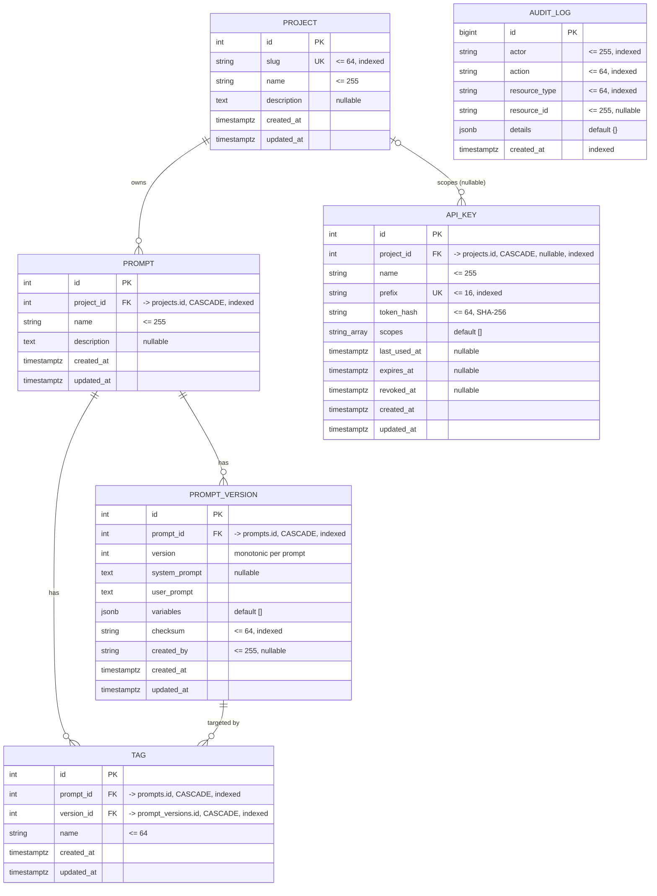

# Database Schema

PostgreSQL schema for the Floating Prompts service. This is the source of truth
for production and is created by Alembic migrations in `apps/service/alembic/`.

The ORM models live in `apps/service/src/floating_prompts/models/`. This doc
mirrors them exactly.

Related docs: [Architecture](ARCHITECTURE.md), [API reference](API.md).

---

## Entity relationship diagram



`AUDIT_LOG` has no foreign keys on purpose. It stores `resource_id` as a free
text string (for example `acme/summarizer@2`) so audit history survives even if
the referenced row is later deleted.

---

## Tables

### `projects`
The top-level namespace. Owns prompts and API keys.

| Column | Type | Notes |
|---|---|---|
| `id` | integer | PK, autoincrement |
| `slug` | varchar(64) | unique, indexed. URL-safe identifier used in API paths |
| `name` | varchar(255) | display name |
| `description` | text | nullable |
| `created_at` / `updated_at` | timestamptz | server managed |

### `prompts`
A prompt's identity within a project. Holds no rendered content.

| Column | Type | Notes |
|---|---|---|
| `id` | integer | PK |
| `project_id` | integer | FK to `projects.id`, `ON DELETE CASCADE`, indexed |
| `name` | varchar(255) | |
| `description` | text | nullable |
| `created_at` / `updated_at` | timestamptz | |

Constraint: `UNIQUE (project_id, name)`. A name is unique within its project.

### `prompt_versions`
One immutable revision of a prompt's content.

| Column | Type | Notes |
|---|---|---|
| `id` | integer | PK |
| `prompt_id` | integer | FK to `prompts.id`, `ON DELETE CASCADE`, indexed |
| `version` | integer | monotonic per prompt, assigned by the service |
| `system_prompt` | text | nullable |
| `user_prompt` | text | the template |
| `variables` | jsonb | declared variable contract, default `[]` (see below) |
| `checksum` | varchar(64) | SHA-256 of content, indexed, for change detection |
| `created_by` | varchar(255) | nullable, the actor that created it |
| `created_at` / `updated_at` | timestamptz | |

Constraint: `UNIQUE (prompt_id, version)`.

`variables` is a list of objects, each:

```json
{ "name": "content", "required": true, "description": null }
```

### `tags`
A movable, named pointer from a prompt to one of its versions.

| Column | Type | Notes |
|---|---|---|
| `id` | integer | PK |
| `prompt_id` | integer | FK to `prompts.id`, `ON DELETE CASCADE`, indexed |
| `version_id` | integer | FK to `prompt_versions.id`, `ON DELETE CASCADE`, indexed |
| `name` | varchar(64) | for example `production`, `staging` |
| `created_at` / `updated_at` | timestamptz | |

Constraint: `UNIQUE (prompt_id, name)`. A tag name is unique within a prompt and
can be moved to a different version.

### `api_keys`
A scoped credential. Only the prefix and a hash are stored, never the plaintext.

| Column | Type | Notes |
|---|---|---|
| `id` | integer | PK |
| `project_id` | integer | FK to `projects.id`, `ON DELETE CASCADE`, nullable (null = global key), indexed |
| `name` | varchar(255) | label |
| `prefix` | varchar(16) | unique, indexed. First characters of the key, used for lookup |
| `token_hash` | varchar(64) | SHA-256 of the full key |
| `scopes` | varchar[] | array, subset of `read`, `write`, `admin` |
| `last_used_at` | timestamptz | nullable, updated on each successful auth |
| `expires_at` | timestamptz | nullable |
| `revoked_at` | timestamptz | nullable, set on revoke |
| `created_at` / `updated_at` | timestamptz | |

### `audit_logs`
Append-only record of every state change. Immutable, so only `created_at`.

| Column | Type | Notes |
|---|---|---|
| `id` | bigint | PK, autoincrement |
| `actor` | varchar(255) | indexed, who performed the action |
| `action` | varchar(64) | indexed, for example `version.create`, `tag.set` |
| `resource_type` | varchar(64) | indexed, for example `prompt`, `tag` |
| `resource_id` | varchar(255) | nullable, free text identifier |
| `details` | jsonb | default `{}`, extra structured context |
| `created_at` | timestamptz | indexed, server default `now()` |

---

## Conventions

- **Primary keys** are surrogate autoincrement integers (`bigint` for
  `audit_logs`).
- **Timestamps** are timezone aware (`timestamptz`), with `created_at` and
  `updated_at` managed by the database. Audit rows have only `created_at`.
- **Cascades.** Deleting a project deletes its prompts and keys. Deleting a
  prompt deletes its versions and tags. This is enforced at the database with
  `ON DELETE CASCADE`.
- **Constraint names** follow a fixed convention so migrations stay stable:
  `pk_<table>`, `fk_<table>_<column>_<referenced_table>`, `uq_<table>_<column>`,
  and `ix_<column>` for indexes. See `db/base.py`.

---

## Migrations

```bash
cd apps/service
uv run alembic upgrade head                         # apply
uv run alembic revision --autogenerate -m "..."     # create after a model change
uv run alembic downgrade -1                          # roll back one step
uv run alembic check                                 # confirm models match the DB
```

Always review an autogenerated migration before committing.
